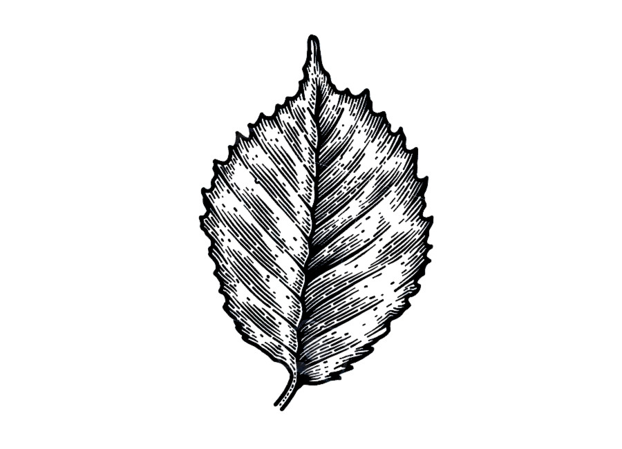

# procjam2019

PROCJAM 2019 - Generation of vintage engravings of leaves

The objective for this project is to generate vintage engravings of leaves (see reference image below).
Exporting them as SVG would be ideal, but given the lack of support for variable width lines this is not planned as of now.

